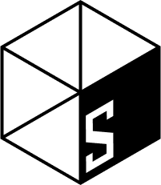

# Behaverse Schemas (WIP)

**custom schemas for cognitive and behavioral sciences**

[](https://creativecommons.org/licenses/by/4.0/)

## Overview

This repository hosts machine-readable schemas and vocabularies for organizing, documenting, and sharing cognitive science data. All schemas are publicly accessible via GitHub Pages and aim to follow semantic web best practices.

**Base URL**: `https://behaverse.org/schemas/`

## Source of truth

For most schemas the single source of truth is a **[LinkML](https://linkml.io/) file**
(`<schema>/schema.linkml.yaml`); all published artifacts (`schema.json`, `context.jsonld`,
and the trial/event `field-definitions.json` render artifact) are **generated** from it with
`python scripts/generate.py`. Edit the LinkML, never the generated files — CI fails the build
if a generated file drifts from its source. Two schemas are exceptions, kept in their
better-fit native formats: **bcsv** (hand-maintained CSVW-based `schema.json`) and
**vocabulary** (SKOS `terms.yaml` → `terms.jsonld`). See [`CONTRIBUTING.md`](CONTRIBUTING.md).

## Schemas

###  bcsv (Better CSV)
Extension of W3C CSVW with support for R/Python data types including categorical and ordered factors, missing value codes, units of measurement, and file integrity verification.

- **Version**: v26.0703  ·  **Source**: hand-maintained `schema.json` (not LinkML)
- **Namespace**: `https://behaverse.org/schemas/bcsv#`
- **Context**: [`bcsv/context.jsonld`](bcsv/context.jsonld) · **JSON Schema**: [`bcsv/schema.json`](bcsv/schema.json) · **Docs**: [`bcsv/README.md`](bcsv/README.md)

**Example property reference**: `https://behaverse.org/schemas/bcsv#ordered`

###  catalog 
Metadata schema for describing thematic catalogs of datasets that share specific characteristics or serve particular research applications. Extends schema.org/DataCatalog. Supports hierarchical organization through nested catalogs.

- **Version**: v26.0703  ·  **Source**: [`catalog/schema.linkml.yaml`](catalog/schema.linkml.yaml)
- **Namespace**: `https://behaverse.org/schemas/catalog#`
- **Context**: [`catalog/context.jsonld`](catalog/context.jsonld) · **JSON Schema**: [`catalog/schema.json`](catalog/schema.json) · **Docs**: [`catalog/README.md`](catalog/README.md)

**Example property reference**: `https://behaverse.org/schemas/catalog#inclusion_criteria`

###  dataset
Metadata schema for describing cognitive science datasets with comprehensive coverage of participant demographics, measurement techniques, cognitive tasks, and data access information.

- **Version**: v26.0703  ·  **Source**: [`dataset/schema.linkml.yaml`](dataset/schema.linkml.yaml)
- **Namespace**: `https://behaverse.org/schemas/dataset#`
- **Context**: [`dataset/context.jsonld`](dataset/context.jsonld) · **JSON Schema**: [`dataset/schema.json`](dataset/schema.json) · **Docs**: [`dataset/README.md`](dataset/README.md)

**Example property reference**: `https://behaverse.org/schemas/dataset#sample_size`

###  studyflow
Schema for defining the formal structure of studyflow diagrams - sequences of activities and resources designed to facilitate experimental research and data analysis. Used by the Studyflow Modeler app.

- **Version**: v25.1217.dev2  ·  **Source**: [`studyflow/schema.linkml.yaml`](studyflow/schema.linkml.yaml)
- **Namespace**: `https://behaverse.org/schemas/studyflow#`
- **Docs**: [`studyflow/README.md`](studyflow/README.md)

**Related**: [Studyflow Modeler Documentation](https://behaverse.org/studyflow-modeler/docs)

### trial
Tidy, multi-table schema describing trial-level behavioral data (responses, stimuli, instruments, …) for cognitive tests and questionnaires, derived from raw events.

- **Version**: v26.0703  ·  **Source**: [`trial/schema.linkml.yaml`](trial/schema.linkml.yaml)
- **Namespace**: `https://behaverse.org/schemas/trial#`
- **JSON Schema**: [`trial/schema.json`](trial/schema.json) · **Render artifact**: [`trial/field-definitions.json`](trial/field-definitions.json) · **Docs**: [`trial/README.md`](trial/README.md)
- _No `context.jsonld` (the trial fields carry no semantic mappings yet)._

### event
Raw experimental events — an xAPI-style envelope (actor / verb / object) carrying the canonical Behaverse `bdm:` vocabulary. Modeled as `EventDocument = Event | EventBatch`.

- **Version**: v26.0615  ·  **Source**: [`event/schema.linkml.yaml`](event/schema.linkml.yaml)
- **Namespace**: `https://behaverse.org/schemas/event#`
- **Context**: [`event/context.jsonld`](event/context.jsonld) · **JSON Schema**: [`event/schema.json`](event/schema.json) · **Render artifact**: [`event/field-definitions.json`](event/field-definitions.json) · **Docs**: [`event/README.md`](event/README.md)

### vocabulary
Cross-cutting controlled terminology (SKOS concept schemes + concepts): general terms, demographics, and the suffix conventions used in variable names — the terms no single schema owns.

- **Version**: v26.0703  ·  **Source**: `vocabulary/terms.yaml` (SKOS; not LinkML)
- **Namespace**: `https://behaverse.org/schemas/vocabulary`
- **SKOS JSON-LD**: [`vocabulary/terms.jsonld`](vocabulary/terms.jsonld) · **Docs**: [`vocabulary/README.md`](vocabulary/README.md)

## Versioning

We use **Calendar Versioning (CalVer)** with the format: `vYY.MMDD[.dev#]`

- **Stable releases**: `v25.1201` (December 1, 2025)
- **Development versions**: `v25.1201.dev2` (second dev iteration on that date)

**Current versions** are in the root of each schema folder. **Historical versions** are archived in the `versions/` subfolder.

Example:
- Current: `dataset/context.jsonld`
- Archived: `dataset/versions/v25.1201/context.jsonld`

### Stability Promise

Property URIs remain stable across versions. For example, `https://behaverse.org/schemas/dataset#sample_size` will always refer to the same concept, even as the schema evolves.

## Repository Structure

The repo has two branches: **`main`** (schema sources + tooling, below) and **`gh-pages`**
(the Docusaurus documentation site). Generated artifacts are committed alongside their LinkML
source so consumers can fetch them directly.

```
behaverse/schemas/                 # (main branch)
├── scripts/
│   ├── generate.py                # unified generator: LinkML -> schema.json / context.jsonld / field-definitions.json
│   ├── linkml_postprocess.py      # JSON-LD / discoverability post-process for the generated artifacts
│   ├── emit_field_definitions.py  # LinkML -> field-definitions.json (trial/event render artifact)
│   └── validate_schemas.py        # well-formedness + example validation (CI)
├── catalog/                       # ┐ LinkML-sourced schemas: each has
│   ├── schema.linkml.yaml         # │   schema.linkml.yaml (source of truth)
│   ├── schema.json                # │   + generated schema.json / context.jsonld
│   ├── context.jsonld             # │   + examples/ + CHANGELOG.md + README.md + versions/
│   ├── examples/  versions/  …    # ┘
├── dataset/                       # (same layout as catalog)
├── trial/                         # multi-table; schema.json + field-definitions.json (no context.jsonld)
├── event/                         # schema.json + context.jsonld + field-definitions.json
├── studyflow/                     # LinkML classes (schema.linkml.yaml)
├── bcsv/                          # hand-maintained schema.json + context.jsonld (not LinkML)
├── vocabulary/                    # SKOS: terms.yaml -> terms.jsonld (vocabulary/scripts/generate.py)
├── requirements-dev.txt           # generation/validation toolchain (LinkML, jsonschema, …)
├── CONTRIBUTING.md  VERSIONING.md
└── README.md
```

## License

These schemas are licensed under [Creative Commons Attribution 4.0 International (CC BY 4.0)](https://creativecommons.org/licenses/by/4.0/).

You are free to:
- **Share**: Copy and redistribute the schemas
- **Adapt**: Remix, transform, and build upon the schemas

Under the following terms:
- **Attribution**: Give appropriate credit to Behaverse

## Contact

- **Issues**: [GitHub Issues](https://github.com/behaverse/schemas/issues)
- **Discussions**: [GitHub Discussions](https://github.com/behaverse/schemas/discussions)
- **Organization**: [Behaverse on GitHub](https://github.com/behaverse)

## Acknowledgments

These schemas build upon and reference established standards including:
- [Schema.org](https://schema.org/)
- [W3C CSVW](https://www.w3.org/TR/tabular-data-primer/)
- [W3C DCAT](https://www.w3.org/TR/vocab-dcat-3/)
- [Dublin Core](https://www.dublincore.org/)
- [BIDS](https://bids-specification.readthedocs.io/)
- [DataCite](https://schema.datacite.org/)

## AI Usage Disclosure 

This document was created with assistance from AI tools.